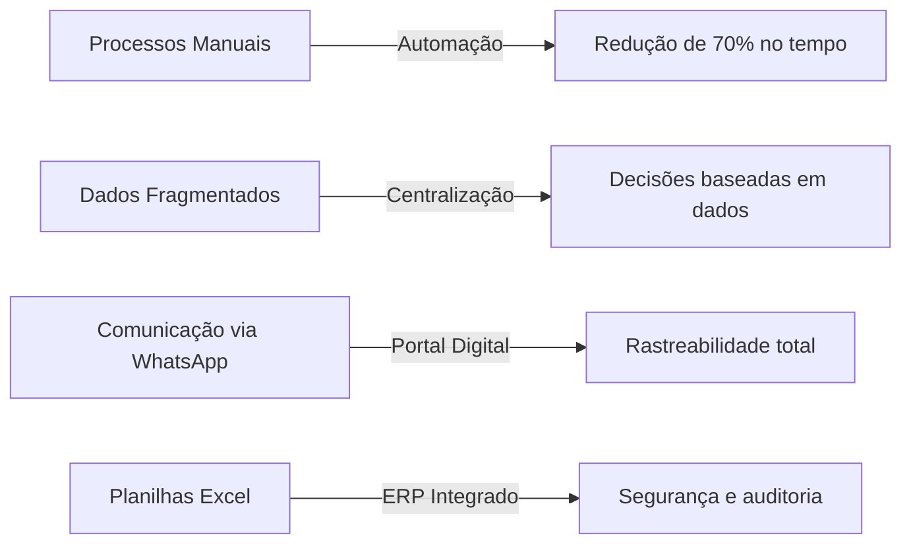
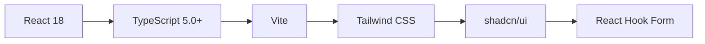
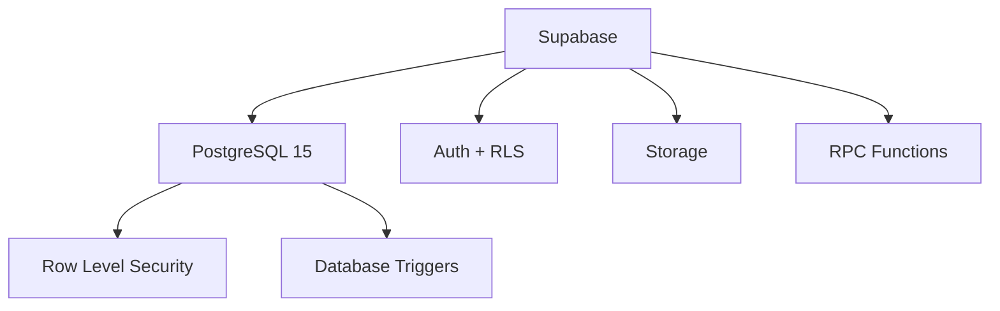
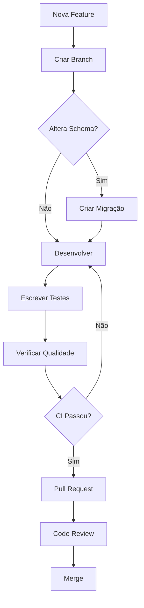

<div align="center">

# 🚌 Agenda-Transfer

### Plataforma ERP Completa para Gestão de Turismo Receptivo

[](https://www.typescriptlang.org/)
[](https://reactjs.org/)
[](https://supabase.com/)
[](https://www.postgresql.org/)
[](https://opensource.org/licenses/MIT)

[Funcionalidades](#-funcionalidades-principais) •
[Instalação](#-instalação-rápida) •
[Documentação](#-documentação) •
[Contribuir](#-contribuindo)

</div>

---

## 📋 Índice

- [Visão Geral](#-visão-geral)
- [Funcionalidades Principais](#-funcionalidades-principais)
- [Tecnologias](#-stack-tecnológico)
- [Arquitetura](#-arquitetura--princípios-de-design)
- [Instalação](#-instalação-rápida)
- [Desenvolvimento](#-desenvolvimento)
- [Testes](#-testes--qualidade)
- [Contribuindo](#-contribuindo)
- [Licença](#-licença)

---

## 🎯 Visão Geral

**Agenda-Transfer** é uma solução ERP empresarial desenvolvida especificamente para **revolucionar a gestão operacional de empresas de turismo receptivo**. Construída com tecnologias modernas e arquitetura escalável, a plataforma elimina processos manuais, centraliza informações críticas e fornece visibilidade em tempo real de todas as operações.

### 🎪 O Desafio

Empresas de turismo receptivo enfrentam desafios únicos:
- ⚡ **Operações fragmentadas** em planilhas, WhatsApp e sistemas desconectados
- 💸 **Controle financeiro complexo** envolvendo múltiplas agências, comissões e motoristas
- 📊 **Falta de visibilidade** sobre a operação em tempo real
- 🔄 **Processos manuais** sujeitos a erros e retrabalho
- 📱 **Comunicação ineficiente** entre equipe interna e parceiros externos

### ✨ Nossa Solução

<table>
<tr>
<td width="50%">

#### 🎮 **Dashboard Operacional Inteligente**
Visualize todas as atividades do dia em tempo real com status, alertas e indicadores de performance

</td>
<td width="50%">

#### 📦 **Gestão Completa de Pacotes**
Crie, edite e acompanhe pacotes turísticos com controle de clientes, atividades e documentação

</td>
</tr>
<tr>
<td width="50%">

#### 💰 **Módulo Financeiro Robusto**
Controle receitas, despesas, comissões de agências e pagamentos de motoristas com relatórios detalhados

</td>
<td width="50%">

#### 🏢 **Cadastros Centralizados**
Gerencie agências parceiras, veículos, motoristas e toda a cadeia operacional em um único lugar

</td>
</tr>
<tr>
<td colspan="2">

#### 🌐 **Portal de Agências Exclusivo**
Parceiros externos criam e gerenciam suas próprias reservas com autonomia total e interface dedicada

</td>
</tr>
</table>

### 📈 Resultados Esperados



> **💡 Objetivo Final:** Transformar operações caóticas em um processo previsível, auditável e escalável, permitindo que gestores foquem no crescimento do negócio ao invés de "apagar incêndios".

---

## 🚀 Funcionalidades Principais

### 📊 Dashboard & Operações
- ✅ Visualização em tempo real de todas as atividades agendadas
- ✅ Filtros avançados por data, status, agência e motorista
- ✅ Indicadores de performance (KPIs) customizáveis
- ✅ Alertas automáticos para conflitos e pendências

### 💼 Gestão de Pacotes
- ✅ Criação rápida de pacotes com templates
- ✅ Controle de múltiplos clientes por pacote
- ✅ Gestão de atividades individuais (transfers, passeios, etc.)
- ✅ Upload e organização de documentos (vouchers, contratos)
- ✅ Histórico completo de alterações

### 💳 Módulo Financeiro
- ✅ Registro de receitas e despesas com categorização
- ✅ Cálculo automático de comissões de agências
- ✅ Controle de pagamentos a motoristas
- ✅ Extrato financeiro com saldo em tempo real
- ✅ Relatórios de DRE e fluxo de caixa
- ✅ Exportação de relatórios em PDF profissional

### 👥 Gestão de Cadastros
- ✅ Agências parceiras com configuração de comissões
- ✅ Motoristas com documentação e disponibilidade
- ✅ Veículos com manutenção e rastreamento
- ✅ Usuários com controle de permissões granular

### 🌍 Portal de Agências
- ✅ Interface dedicada para parceiros externos
- ✅ Criação self-service de reservas
- ✅ Acompanhamento de status em tempo real
- ✅ Histórico de transações e comissões

---

## 🛠 Stack Tecnológico

### Frontend


| Tecnologia | Versão | Propósito |
|:-----------|:------:|:----------|
| **React** | 18+ | UI reativa com componentes funcionais |
| **TypeScript** | 5.0+ | Type safety e melhor DX |
| **Vite** | Latest | Build tool ultra-rápido |
| **Tailwind CSS** | 3+ | Utility-first CSS framework |
| **shadcn/ui** | Latest | Componentes acessíveis e customizáveis |
| **React Hook Form** | Latest | Gerenciamento performático de formulários |
| **React Router** | 6+ | Roteamento SPA |
| **date-fns** | Latest | Manipulação de datas |
| **jsPDF** | Latest | Geração de relatórios PDF |

### Backend & Infraestrutura


| Tecnologia | Propósito |
|:-----------|:----------|
| **Supabase** | Backend-as-a-Service completo |
| **PostgreSQL** | Banco de dados relacional robusto |
| **Row Level Security** | Segurança a nível de linha |
| **RPC Functions** | Lógica de negócio no servidor |
| **Supabase Auth** | Autenticação e autorização |
| **Supabase Storage** | Armazenamento de arquivos |

### Testes & Qualidade
| Ferramenta | Propósito |
|:-----------|:----------|
| **Vitest** | Testes unitários e de integração |
| **React Testing Library** | Testes focados no comportamento do usuário |
| **Playwright** | Testes E2E e regressão visual |
| **ESLint** | Análise estática de código |
| **TypeScript Compiler** | Verificação de tipos |

---

## 🏗 Arquitetura & Princípios de Design

### Princípios Fundamentais

#### 1️⃣ **Backend-First Logic**
```typescript
// ❌ Evitar: Lógica complexa no cliente
const calculateCommission = (value: number, rate: number) => value * rate;

// ✅ Preferir: RPC Functions no PostgreSQL
const { data } = await supabase.rpc('calculate_agency_commission', {
  package_id: id
});
```

**Benefícios:**
- ⚡ Performance superior com processamento no banco
- 🔒 Lógica de negócio protegida e centralizada
- 🔄 Transações atômicas garantidas
- 📊 Agregações eficientes com SQL otimizado

#### 2️⃣ **Security-First com RLS**
```sql
-- Exemplo de política RLS
CREATE POLICY "Users can only see their company's packages"
ON packages FOR SELECT
USING (company_id = auth.jwt() ->> 'company_id');
```

**Camadas de Segurança:**
- 🛡️ Row Level Security como camada primária
- 🔐 Autenticação JWT com Supabase Auth
- 👤 Autorização baseada em roles
- 📝 Auditoria automática de operações

#### 3️⃣ **Infrastructure as Code**
```bash
supabase/migrations/
├── 20240101_initial_schema.sql
├── 20240115_add_finance_tables.sql
└── 20240201_add_rls_policies.sql
```

**Regra de Ouro:** 
> ⚠️ **NUNCA altere o schema manualmente no painel do Supabase!**  
> Todas as alterações devem ser versionadas em arquivos de migração.

#### 4️⃣ **Data Stitching Pattern**
```typescript
// Múltiplas queries específicas
const [revenues, expenses, commissions] = await Promise.all([
  fetchRevenues(filters),
  fetchExpenses(filters),
  fetchCommissions(filters)
]);

// Combinação no cliente
const financialSummary = combineFinancialData(revenues, expenses, commissions);
```

**Vantagens:**
- 🔄 Resiliência a mudanças no schema
- 🐛 Debug simplificado
- ⚡ Paralelização de queries
- 🧪 Testes unitários mais fáceis

---

## 📁 Estrutura do Projeto

```
agenda-transfer/
│
├── 📂 supabase/                    # Infraestrutura como código
│   ├── migrations/                 # Migrações SQL versionadas
│   └── seed.sql                    # Dados iniciais para desenvolvimento
│
├── 📂 src/
│   ├── 📂 components/              # Componentes React
│   │   ├── finance/                # Módulo financeiro
│   │   ├── packages/               # Gestão de pacotes
│   │   ├── ui/                     # Componentes base (shadcn/ui)
│   │   └── ...
│   │
│   ├── 📂 services/                # Camada de acesso a dados
│   │   ├── financeApi.ts           # API financeira
│   │   ├── packagesApi.ts          # API de pacotes
│   │   └── ...
│   │
│   ├── 📂 contexts/                # Contextos React
│   │   └── AuthContext.tsx         # Autenticação global
│   │
│   ├── 📂 pages/                   # Páginas/Rotas
│   │   ├── Dashboard.tsx
│   │   ├── Finance.tsx
│   │   └── ...
│   │
│   ├── 📂 types/                   # Definições TypeScript
│   │   └── database.types.ts       # Tipos gerados do schema
│   │
│   └── 📂 lib/                     # Configurações
│       └── supabase.ts             # Cliente Supabase
│
├── 📂 tests/                       # Testes E2E (Playwright)
│
└── 📄 package.json
```

---

## ⚡ Instalação Rápida

### Pré-requisitos
- Node.js >= 18.0.0
- npm >= 9.0.0
- Conta no Supabase (gratuita)

### Setup em 3 Passos

```bash
# 1. Clone e instale dependências
git clone https://github.com/seu-usuario/agenda-transfer.git
cd agenda-transfer
npm install

# 2. Configure variáveis de ambiente
cp .env.example .env
# Edite .env com suas credenciais do Supabase

# 3. Aplique migrações e inicie
npx supabase db push
npm run dev
```

🎉 **Aplicação rodando em** `http://localhost:5173`

---

## 💻 Desenvolvimento

### Scripts Disponíveis

| Comando | Descrição |
|:--------|:----------|
| `npm run dev` | Inicia servidor de desenvolvimento |
| `npm run build` | Build de produção |
| `npm run preview` | Preview da build de produção |
| `npm test` | Executa testes unitários (Vitest) |
| `npm run test:ui` | Interface visual dos testes |
| `npm run check` | Lint + Type check |
| `npx playwright test` | Testes E2E |

### Workflow de Desenvolvimento



#### Padrão de Branches
- `main` - Branch principal (protegida)
- `feat/<nome>` - Novas funcionalidades
- `fix/<nome>` - Correções de bugs
- `chore/<nome>` - Tarefas de manutenção

#### Commits Convencionais
```bash
feat: add financial statement export to PDF
fix: resolve balance calculation on date filter
chore: update dependencies
docs: improve README architecture section
```

### Criando uma Migração

```bash
# Gerar timestamp
date +"%Y%m%d%H%M%S"

# Criar arquivo
touch supabase/migrations/$(date +"%Y%m%d%H%M%S")_add_new_feature.sql

# Escrever SQL
-- Adicionar tabelas, RLS policies, funções, etc.

# Aplicar localmente
npx supabase db push
```

---

## 🧪 Testes & Qualidade

### Pirâmide de Testes

```
        /\
       /E2E\        ← Poucos testes críticos de fluxo
      /------\
     /  INTEG \     ← Testes de integração de serviços
    /----------\
   /   UNITÁRIOS  \ ← Muitos testes de lógica isolada
  /----------------\
```

### Executando Testes

```bash
# Testes unitários (watch mode)
npm test

# Testes com cobertura
npm run test:coverage

# Testes E2E
npx playwright test

# Modo visual (debug)
npx playwright test --ui
```

### Padrões de Qualidade

- ✅ **Cobertura mínima:** 80% para serviços críticos
- ✅ **Type safety:** Zero erros do TypeScript
- ✅ **Lint:** Zero avisos do ESLint
- ✅ **E2E:** Fluxos críticos cobertos

---

## 🤝 Contribuindo

Contribuições são bem-vindas! Para contribuir:

1. 🍴 Fork o projeto
2. 🌿 Crie uma branch (`git checkout -b feat/amazing-feature`)
3. ✍️ Commit suas mudanças (`git commit -m 'feat: add amazing feature'`)
4. 📤 Push para a branch (`git push origin feat/amazing-feature`)
5. 🔃 Abra um Pull Request

### Checklist do PR

- [ ] Código segue os padrões do projeto
- [ ] Testes passando (`npm test`)
- [ ] Type check sem erros (`npm run check`)
- [ ] Migração criada (se alterou schema)
- [ ] Documentação atualizada
- [ ] Commits seguem padrão convencional

---

## 📄 Licença

Este projeto está licenciado sob a **MIT License** - veja o arquivo [LICENSE](LICENSE) para detalhes.

---

<div align="center">

### 🌟 Se este projeto te ajudou, considere dar uma estrela!


[⬆ Voltar ao topo](#-agenda-transfer)

</div>
