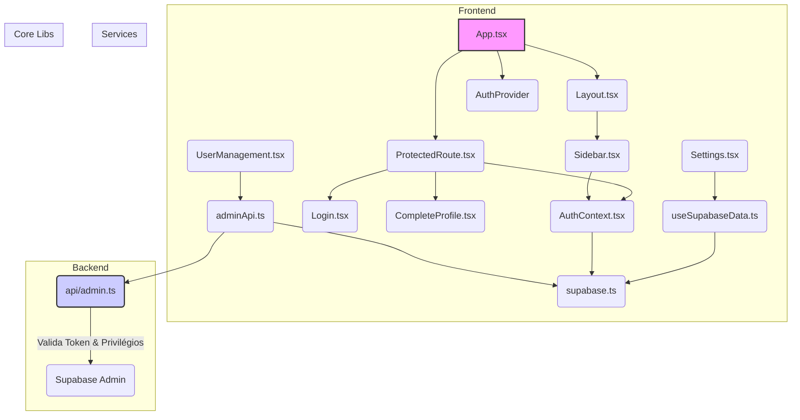

# Mapa de Dependências e Checklist de Validação

Este documento contém o mapa de dependências críticas e um checklist para validar a aplicação após a remoção dos arquivos mortos.

## 1. Mapa de Dependências Críticas

O diagrama abaixo ilustra as dependências centrais da aplicação. A remoção ou alteração incorreta de qualquer um desses arquivos provavelmente causará falhas significativas.

**Legenda:**
- **`App.tsx`**: Orquestrador principal, define rotas e contextos.
- **`AuthContext.tsx`**: Coração da autenticação e gerenciamento de sessão.
- **`adminApi.ts`**: Ponto de comunicação do frontend com a API de administração.
- **`api/admin.ts`**: Endpoint seguro do backend para operações privilegiadas.
- **`supabase.ts`**: Cliente Supabase, usado por quase toda a aplicação para interagir com o banco de dados.

---

## 2. Checklist de Validação Pós-Limpeza

Após executar o script `cleanup_dead_code.sh` e remover manualmente as importações e configurações, siga os passos abaixo para garantir que a aplicação não foi quebrada.

### Passos de Verificação no Código

- [ ] **Remover `DataProvider` de `App.tsx`:**
    -   Abra `src/App.tsx`.
    -   Remova a linha `import { DataProvider } from './contexts/DataContext';`.
    -   Remova as tags `<DataProvider>` e `</DataProvider>` que envolvem a aplicação.

- [ ] **Limpar Configuração `paths` do `tsconfig`:**
    -   Abra `tsconfig.json` e `tsconfig.app.json`.
    -   Remova a chave `"paths": { "@/*": ["src/*"] }` de ambos os arquivos.

### Passos de Verificação Funcional

1.  **Verificação de Build e Execução:**
    -   [ ] Execute `npm install` para garantir que nenhuma dependência foi afetada.
    -   [ ] Execute `npm run build`. O processo deve ser concluído sem erros.
    -   [ ] Execute `npm run dev`. O servidor de desenvolvimento deve iniciar sem warnings ou erros relacionados a importações quebradas.

2.  **Verificação de Autenticação e Rotas:**
    -   [ ] Acesse a aplicação no navegador. A página de login deve carregar corretamente.
    -   [ ] Realize o login com um usuário de teste.
    -   [ ] O redirecionamento para o Dashboard deve ocorrer sem problemas.
    -   [ ] Navegue por todas as páginas do menu: `Dashboard`, `Agenda`, `Reservas`, `Cadastros`, `Usuários`. Todas devem carregar sem erros no console.

3.  **Verificação de Funcionalidades Críticas:**
    -   [ ] **Cadastros (`/cadastros`):**
        -   [ ] Clique em cada uma das abas (Agências, Veículos, Motoristas, Atrativos).
        -   [ ] Verifique se os dados são carregados corretamente em cada aba.
        -   [ ] Tente adicionar, editar e remover um item em uma das abas para garantir que as operações CRUD ainda funcionam.
    -   [ ] **Gerenciamento de Usuários (`/usuarios`):**
        -   [ ] A lista de usuários deve ser carregada.
        -   [ ] Tente alterar o status de um usuário.
        -   [ ] Tente alterar a permissão de administrador de um usuário.
    -   [ ] **Logout:**
        -   [ ] Clique no botão de sair. A sessão deve ser encerrada e o usuário redirecionado para a página de login.

4.  **Verificação Final:**
    -   [ ] Abra o console do desenvolvedor do navegador e navegue pela aplicação. Nenhum erro de 404 (importação não encontrada) ou erro de runtime deve aparecer.
    -   [ ] Execute `npm run check` (`lint` + `typecheck`). O comando deve passar sem erros.